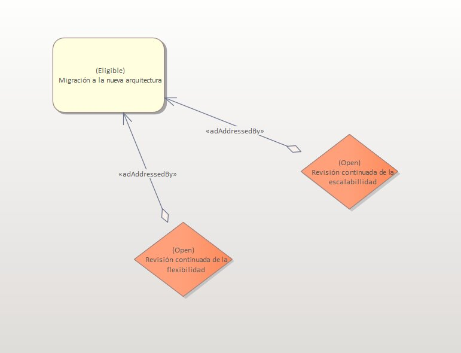

# ADR-0001 Migración-nueva-arquitectura

## Identificador del Requisito

Requisito a tratar: 
* [RF1.2](../Requisitos/rf1.2.md) "Migración de la nueva arquitectura" 
* [RF1.3](../Requisitos/rf1.3.md) "Mejorar flexibilidad y escalabilidad"

## Contexto y problemas a resolver

El cliente posee un sistema basado en una arquitectura Web de tres capas que desea migrar a una de microservicios. Las decisiones tomadas
se enfocarán en establecer unas correctas bases para asegurar la escalabilidad y la flexibilidad de la nueva arquitectura.

## Decisiones a tratar:

En este apartado se encontrarán las decisiones que se tomarán durante el desarrollo de la migración y el nuevo sistema. Se irán sumando mediante
el paso de las semanas y las iteraciones.

## Decisiones tomadas

La decisión tomada para estos requisitos es comprobar durante el desarrollo de la migración la sostenibilidad de las funcionalidades en cuanto a escalabilidad
y flexibilidad. No podemos implementarlas como tal, pero sí asegurar mediante la creación de las clases, que éstas serán escalables y flexibles.

### Consecuencias positivas <!-- optional -->

* Seguridad en implementación de escalabilidad.
* Seguridad en implementación de flexibilidad.
* Revisión continua de estas características.
* Nivel detallado de estas características.

### Consecuencias negativas <!-- optional -->

* No se vislumbra una escalabilidad palpable desde el comienzo del desarrollo de la migración
* Posible pérdida del contacto con estos requisitos durante el desarrollo de la migración

### Discusión ASC: Arquitectura de Microservicios

En esta decisión, los ASC no toman parte del proceso porque se encargarán de revisarlo periodicamente durante el desarrollo de la migración y la implementación
de la arquitectura de microservicio.

**Decisión ASC: decisión suspendida**

## Decisión final tomada

Opción elegida: Revisión de la escalabilidad y flexibilidad de la arquitectura.

## Capturas CONTROL 

## UML de la decisión

No se realiza ningún esquema UML debido a que es una decisión general de arquitectura sin tratar ninguna clase en concreto.

