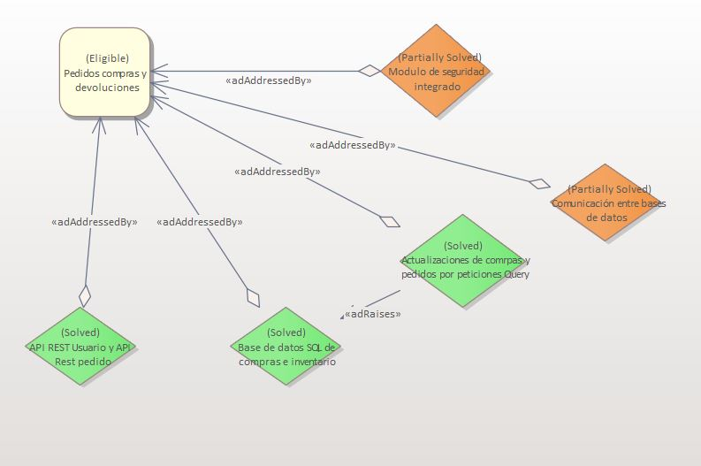
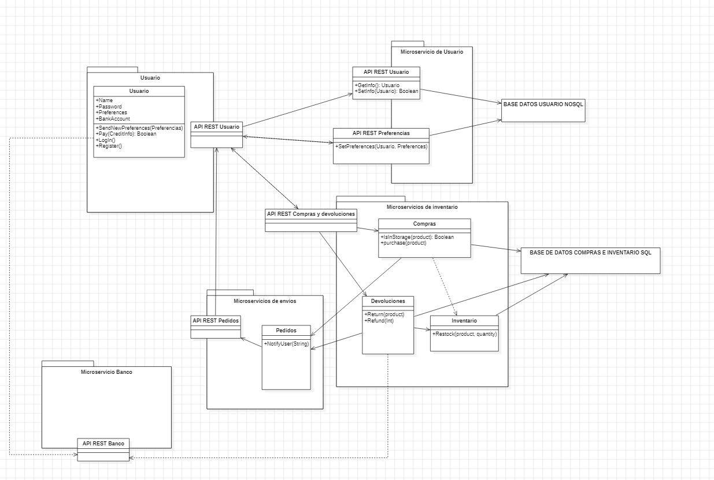

# ADR-0005 Modulo de pedidos, compras y módulo de devoluciones

## Identificador del Requisito

Requisito a tratar: 
* [RF3.1](https://github.com/kikmar/DAS-GRUPO-8/blob/feature/Semana2/Semana%202/Requisitos/rf3.1.md) "Módulo de pedidos y compras"
* [RF3.5](https://github.com/kikmar/DAS-GRUPO-8/blob/feature/Semana2/Semana%202/Requisitos/rf3.5.md) "Módulo de seguridad en compras"
* [RF3.6](https://github.com/kikmar/DAS-GRUPO-8/blob/feature/Semana2/Semana%202/Requisitos/rf3.6.md) "Módulo de devoluciones"

## Contexto y problemas a resolver

El cliente posee un sistema basado en una arquitectura Web de tres capas que desea migrar a una de microservicios. La toma de decisiones ahora se enfocarán en diseñar correctamente
el nuevo módulo de pedidos y compras como exige el cliente. También se tratará de afrontar el problema del módulo de devoluciones.

## Decisiones a tratar:

* **Opcion 1**: A través de los microservicios de inventario y envíos se gestionarán tanto compras y pedido como devoluciones. Esto debe separarse y repartirse correctamente. Además, se integrará el módulo de seguridad en compras
dentro del de pedidos y compras, para asegurar este como una parte del desarrollo del módulo, de forma que sea revisable, acorde y escalable si fuera necesario. El módulo de compras se gestionará comunicandose con los clientes vía HTTP, ya sea desde dispositivos
móviles o web, incluyendo sus respectivas API rest para lograrlo. Las compras se almacenarán en la base de datos SQL, ya que el cliente así lo especifica. En la misma base de datos se almacenará información sobre el stock de la compañía, para comprobar que las peticiones de compra sean dadas como válidas o no.
Esta información debe mostrarse antes de realizar cualquier tipo de compra. En caso de que sea posible realizarla, esta debe ser acometida a través de una petición Query sobre la base de datos. Por otro lado, los pedidos deben gestionarse de manera independiente. Una vez realizada una compra, esta debe notificarse al microservicio de pedidos. Notificará al usuario el estado del mismo
cuando este sufra una actualización, y lo comunicará vía HTTP a través de dos API rest, una para el usuario y otra para el servicio de pedidos. Lo mismo ocurrá con las devoluciones, salvo que este debe iniciarse desde el módulo del usuario, como es lógico. Los datos de las devoluciones
deben almacenarse en la base de datos SQL de las compras, y también debe comunicarse con el servicio de inventario, para actualizarse en caso de ocurra una devolución, y de nuevo, lanza otro tipo de petición Query.
* **Opcion 2**: Las DB SQL que almacena inventario y compras puede separarse en dos bases de datos para que están sean más escalables y flexibles.
* **Opcion 3**: Con respecto a la Opción 1, para mantener un mayor nivel de coherencia con decisiones anteriores, las APIs deberían separarse para que cumplan una única función concreta. Es decir, el microservicio de compras se comunicaía, por un lado con clientes web y por otro con clientes móvil, y a través
de otra API con las diferentes DB.

## Decisiones tomadas

* **OPCION 1 ELEGIDA**: Nos parece la más coherente y escalable pensando en las futuras implementaciones. Si en un futuro tomaremos decisiones entorno a la comunicación entre microservicios y bases de datos, agrupar las API
de esta manera nos parece lo más sensato, y no parece que presente problemas para asegurar su implementación y manejo asegurando así la flexibilidad de la misma. Además, es absurdo separar la base de datos en SQL puesto que parece obvio que el stock y las compras están fuertemente relacionadas, y el cliente especifica que debe ser así, la
base de datos NOSql para información del usuario y la base de datos SQL para compras, por lo que, al ser una información que debe ser almacenada, concuerda más con el tipo de información SQL.

### Consecuencias positivas <!-- optional -->

* Seguridad informática revisable y acorde a los datos que el sistema almacena al implementarse a lo largo del desarrollo.
* El sistema de devoluciones tiene un comportamiento similar al de compras, lo que facilita su implementación.
* El sistema de compras se relaciona con el stock asegurando un buen funcionamiento del sistema en todos los posibles casos.
* Se aseguran varios puntos que el cliente exige

### Consecuencias negativas <!-- optional -->

* Las bases de datos no están correctamente conectadas en este punto de la implementación y puede suponer un problema al esclarecer estas soluciones 
* Es probable que la base de datos SQL sea demasiado compleja de manejar

### Discusión ASC: Modulo de pedidos, compras y módulo de devoluciones

+ Bueno, ya que se satisface lo que demanda el cliente.
+ Bueno, ya que al ser sistemas de similar implementación se ahorrarán tanto tiempo como costes de desarrollo.
+ Bueno, ya que las compras y el stock se relacionan ofreciéndonos un mejor rendimiento del sistema.
+ Malo, ya que puede darse el caso de que encontremos disonancias entre las BBDD
+ Malo, ya que aumenta la complejidad del manejo de las BBDD

**Decisión ASC: Opcion 1**

## Decisión final tomada

**Opción elegida:** opción 1

## Capturas CONTROL 

## UML de la decisión

