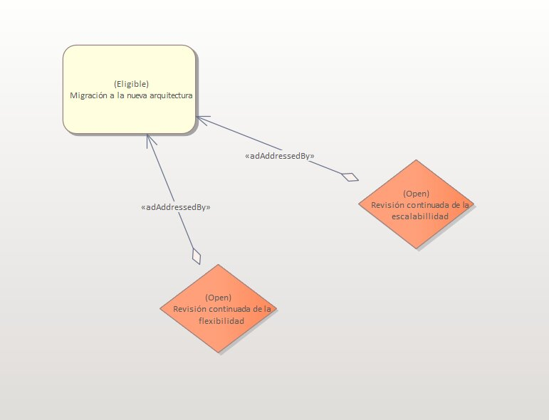
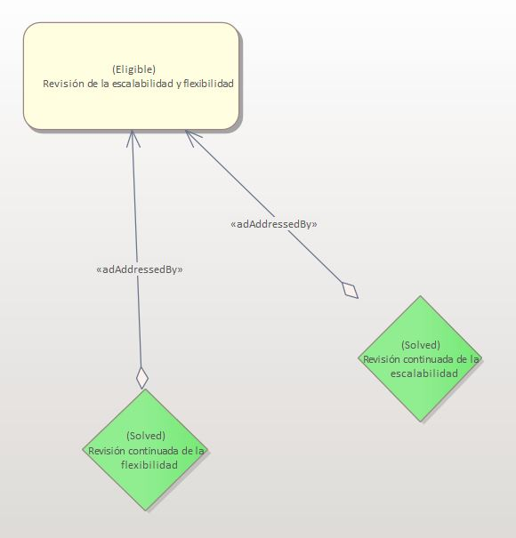

# ADR-0001 Migración-nueva-arquitectura

## Identificador del Requisito

Requisito a tratar: 
* [RF1.2](../Requisitos/rf1.2.md) "Migración de la nueva arquitectura" 
* [RF1.3](../Requisitos/rf1.3.md) "Mejorar flexibilidad y escalabilidad"

## Contexto y problemas a resolver

El cliente posee un sistema basado en una arquitectura Web de tres capas que desea migrar a una de microservicios. Las decisiones tomadas
se enfocarán en establecer unas correctas bases para asegurar la escalabilidad y la flexibilidad de la nueva arquitectura.

## Decisiones a tratar:

En este apartado se encontrarán las decisiones que se tomarán durante el desarrollo de la migración y el nuevo sistema. Se irán sumando mediante
el paso de las semanas y las iteraciones.

## Decisiones tomadas

La decisión tomada para estos requisitos es comprobar durante el desarrollo de la migración la sostenibilidad de las funcionalidades en cuanto a escalabilidad
y flexibilidad. No podemos implementarlas como tal, pero sí asegurar mediante la creación de las clases, que éstas serán escalables y flexibles.

### Consecuencias positivas <!-- optional -->

* Seguridad en implementación de escalabilidad.
* Seguridad en implementación de flexibilidad.
* Revisión continua de estas características.
* Nivel detallado de estas características.

### Consecuencias negativas <!-- optional -->

* No se vislumbra una escalabilidad palpable desde el comienzo del desarrollo de la migración
* Posible pérdida del contacto con estos requisitos durante el desarrollo de la migración

### Discusión ASC: Migracióna a la nueva arquitectura

En esta decisión, los ASC no toman parte del proceso porque se encargarán de revisarlo periodicamente durante el desarrollo de la migración y la implementación
de la arquitectura de microservicio.

**Decisión ASC: decisión suspendida**

## Decisión final tomada

Opción elegida: Revisión de la escalabilidad y flexibilidad de la arquitectura.

## Capturas CONTROL 

## UML de la decisión

No se realiza ningún esquema UML debido a que es una decisión general de arquitectura sin tratar ninguna clase en concreto.

##Actualización de la decisión

* **Fecha de la revisión**: 14/11/2021

Tras terminar el diseño de la arquitectura, ha quedado constancia de que durante el desarrollo de la misma, la escalabilidad y la flexibilidad tras la migración ha sido revisada en todas las tomas de decisión, siendo un factor muy influyente en muchas de ellas. A lo largo de los documento de las decisiones, se podrá observar como formar parte de las mismas. Por este motivo, tras la reunión de los ASS queda declarado que se ha asegurado una buena escalabilidad y flexibilidad en el nuevo sistema tras la migración del mismo, por lo que no vemos necesario actualizar nada tras nuevamente revisar cada una de las decisiones.

## Decisiones tomadas

No actualizar ningún elemento de la arquitectura puesto que consideramos lo suficientemente escalable y flexible.

### Discusión ASC

En esta revisión de la decisión, los ASC no toman parte por dos motivos: el primero es que han revisado constantemente la escalabilidad y flexibilidad durante el desarrollo de la nueva arquitectura. El segundo, es que como los ASS han decidido no actualizar nada, en este punto de la arquitectura todas las decisiones tomadas ya han sido aprobadas por los ASC, por lo que se considera que no hay nada nuevo que discutir.

## Decisión final tomada

**Opción elegida**: Mantener el sistema como está.

## Nuevas capturas CONTROL 

