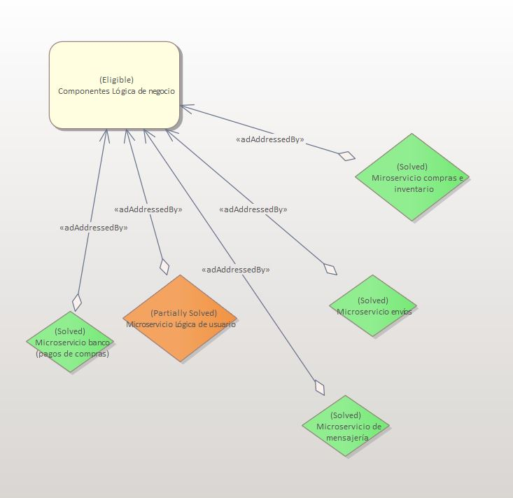

# ADR-0003 Componentes-logica-de-negocio

## Identificador del Requisito

Requisito a tratar:
* [RF3](../Requisitos/rf3.md) "Componentes lógica de negocio"

## Contexto y problemas a resolver

En esta toma de decisiones se plantearán los problemas correspondientes a elegir el número de microservicios necesarios para diseñar todos los componentes dentro de la lógica de negocios. Para lograrlo, trataremos de tomar decisiones repasando
los requisitos obtenidos como subrequisitos del RF3.

## Decisiones a tratar:

* **Opcion 1**: Repasando los requisitos parece lógico compaginar el número de los mismos con el número de microservicios a diseñar. En total, resultaría tener uno que gestione la lógica de usuarios (ya existente), otro para la gestión de compras y acceso a la plataforma de pago,
  otro para pedidos de compras y devoluciones, y otro para mensajería y seguridad.
* **Opcion 2**: Si tomamos la decisión de orientar el diseño a una aplicación más orientada a los microservicios, podemos entender que, además del microservicio de la lógica de usuario ya existente, podemos repartir la lógica de pedidos, compras y devoluciones en varios microservicios,
  resultando en obtener un microservicio para compras e inventario y otro para gestionar envíos. Por otro lado, un microservicio de mensajería parece necesario en cualquier opción. Además incluiríamos otro microservicio para gestionar los pagos de las compras que realice el usuario,
  conectando la aplicación con el banco del mismo.
* **Opcion 3**: Esta opción resultaría parecida a la anterior, con la diferencia de que la lógica de compras, devoluciones e inventario, se gestiona de otra manera. Por un lado, el inventario se gestiona de manera independiente, mientras que las compras y devoluciones pueden mantenerse como un único microservicio.

## Decisiones tomadas

**Opcion 2 elegida**: Parece que la segunda opción es la más correcta, ya que es la que gestiona mejor todos los componentes del sistema. Si bien es cierto que un sólo microservicio para gestionar compra, inventario y devoluciones puede resultar inabarcable, a la hora de implementarlo puede resultar más sencillo, porque a priori, parece claro
que estos tres servicios pueden gesitonarse mediante una sola API (a no ser que, en el momento de tomar la decisión correspondiente, se considere lo contrario). Por otro lado, esta información debe almacenarse en una sola base de datos, y ahorraría costes a la hora de implementarlo pues habría que conectarla con más de un microservicio.

### Consecuencias positivas <!-- optional -->

* La lógica de relaciones para el futuro parece que quedará bastante clarificado con esta decisión.
* Parece muy consistente con los requisitos pedidos
* Gracias a juntar compras, devoluciones e inventario en un solo requisito, podemos ahorrar en la implentación de las conexiones de bases de datos.

### Consecuencias negativas <!-- optional -->

* La opción 2 es una opcion muy similar, que a priori, con los requisitos en la mano, parace más obvio que quedará implementado.
* Implementar las clases con esta decisión dentro de los microservicios puede quedar algo emborronado, especialmente en los microservicios de envío y compras y devoluciones.

### Discusión ASC: Arquitectura de Microservicios

+ Bueno, al ser cada servicio una pequeña aplicación, es mas sencillo y mas rápido innovar o mejorar ese servicio, asegurando la escalabilidad y flexibilidad.
+ Bueno, en caso de tener que realizar cambios, solo tendremos que desplegar el servicio que ha sido cambiado en vez de toda la aplicación.
+ Bueno, al ser cada microservicio totalmente autónomo, por ejemplo, en una tienda on-line si se cae el microservicio que se ocupa del sistema de pago, el usuario no podrá finalizar su compra mientras no se solucione el problema, pero si que podrá seguir navegando por el catálogo de productos sin problemas.
- Malo, complejidad adicional de los sistemas distribuidos (implementar comunicación interna entre los servicios, implementar dependencias de un servicio hacía el otro, solicitudes que pueden extenderse a varios servicios, etc).
- Malo, mayor consumo de recursos, puesto que cada microservicio tiene su propio Sistema Operativo y dependencias.

**Decisión ASC: Opcion 2**

## Decisión final tomada

**Decisión: Opcion 2** 
El hecho de que haga la implementación más sencilla, facilite su gestión y mantenimiento y además reduzca el coste de servidores, hace que se convierta en la opción por la que nos decantamos y que creemos que puede aportar más beneficios a largo plazo.

## Capturas CONTROL

## UML de la decisión

En este apartado preferimos abstenernos de incluir un UML, ya que incluir los microservicios mencionados sin que estén conectados no parece que aporte ningún tipo de información.

