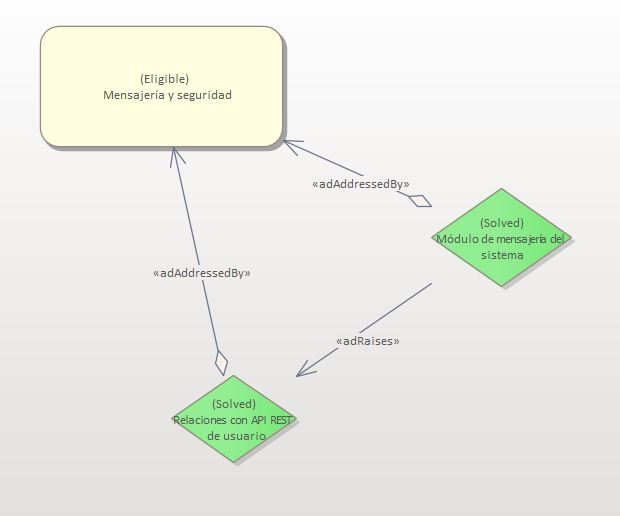
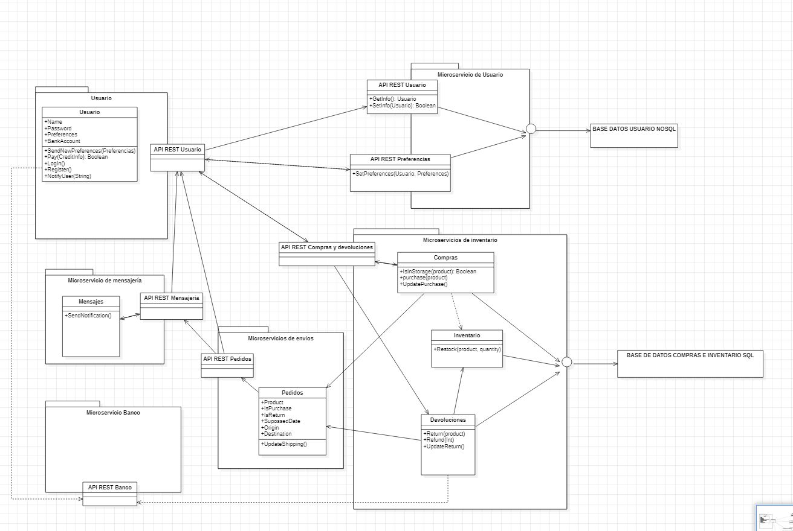

# ADR-0006 Modulo de mensajeria y modulo de seguridad

## Identificador del Requisito

Requisito a tratar: 
* [RF3.4](../Requisitos/rf3.4.md) "Módulo de mensajería a dispositivos móviles"

## Contexto y problemas a resolver

Se solicita implementar en un módulo de microservicios la funcional de la mensajería a dispositivos móviles, por lo tanto, es necesario diseñar el microservicio asociado a esta funcionalidad de la aplicación.

## Decisiones a tratar:

* **Opcion 1**:  En la base de datos SQL se guardarán los datos relacionados con las compras devoluciones e inventarios de la aplicación, por lo tanto este módulo API REST se comunicará con esta BBDD mediante peticiones QUERY para recoger la información persistente necesaria para la creación de la mensajería móvil. En esta opción se implementará la API REST en Java.
* **Opcion 2**:  EL mismo procedimiento que la opción 1 solo que desarrollado en Python.
* **Opcion 3**: EL mismo procedimiento que la opción 1 solo que desarrollado en NodeJs.
* **Opcion 4**: Se realizará en este caso una nueva Base de Datos para conectar al módulo de mensajería.

## Decisiones tomadas

Opción 1 elegida: Se elije debido a que es necesario la creación de un microservicio exclusivo de la mensajería y ya de paso aprovechar la información de la BBDD SQL para un correcto aprovechamiento del espacio y una mayor optimización a la hora de realizar las peticiones QUERY a las bases de datos asociadas a los microservicios.

### Consecuencias positivas <!-- optional -->

* Seguridad en implementación con escalabilidad del sistema.
* Seguridad en implementación con flexibilidad del sistema.
* JAVA es un lenguaje preparado para albergar este tipo de aplicaciones, lo que puede ser de ayuda a la hora de implementarlo y escalarlo.
* El sistema de mensajería al estar en un microservicio aparte implementado por una API REST nos permite diferenciarlo de los demás y poder utilizarlo en los entornos y situaciones que mejor convengan al desarrollo de la funcionalidad de la aplicación.
* La Base de Datos SQL estaría correctamente conectada a este microservicio como al de compras y devoluciones permitiendo una mayor integración de los sistemas de mantenimiento de la información.
* Debido a la integridad de los datos que nos aporta la BBDD nos aporta una mayor robusted a la hora de utilizar esos datos en el módulo de mensajería permitiendo minimizar los errores al mínimo.

### Consecuencias negativas <!-- optional -->

* Se podría tomar otro lenguaje de programación más acorde al equipo de trabajo que facilite la implementación.
* Si no se realizan unas buenas prácticas, al compartir la base de datos con otro microservicio podría dar lugar a colisiones o inconsistencias de datos que nos podría dificultar el mantenimiento y empeorar el correcto funcionamiento de la funcionalidad de la aplicación.
* Hay que tener un correcto cálculo y monitorización de las peticiones así como sus tiempos de respuesta para comprobar la optimización de la utilización de una única base de datos para estos dos microservicios.
* Hay que implementar de forma correcta cuando va a intervenir el microservicio de mensajería móvil para que no haya incompatibilidad con otros sistemas para el cuál no esta pensado.

### Discusión ASC: Modulo de mensajeria y modulo de seguridad

+ Bueno, porque respeta los patrones de flexibilidad y escalabilidad.
+ Bueno, ya que no presenta retos muy complicado en su implementación, y parece bastante modularizado.
+ Bueno, ya que al estar en un microservicio aparte implementado por una API REST nos permitirá utilizarlo en un futuro de la forma que más nos convenga.
+ Bueno, ya que se reduce al mínimo la posibilidad de errores gracias a la robustez que nos ofrece la BDDD debido a la integridad de los datos.
+ Bueno, ya que analizando los requisitos no hace falta la creación de una BBDD nueva siendo posible reutilizar la utilizada en el módulo de compras.
+ Malo, ya que es posible que exista algún tipo de incompatibilidad con otros sistemas en el momento que intervenga el microservicio de mensajería móvil.
+ Malo, ya que el lenguaje de programación más apropiado parece ser Python por enicma de JAVA.
+ Malo, ya que hay que llevar una monitorización precisa para que la utilización de las BBDD sea óptima.

**Decisión ASC: Opcion 2**

## Decisión final tomada

**Opción elegida: Opción 2.** 
Al igual que en la decisión 004, el punto de Python sobre JAVA nos ha parecido determinante para la elección de esta opción sobre el resto de opciones comentadas.

## Capturas CONTROL 

## UML de la decisión

