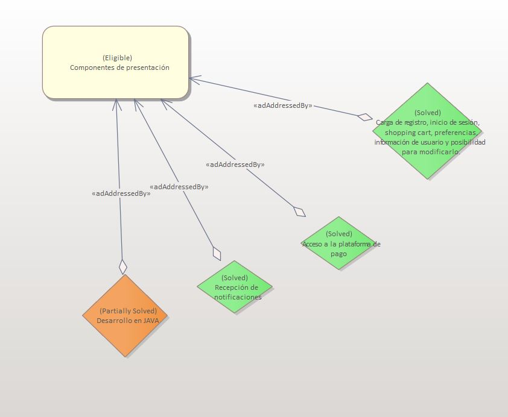
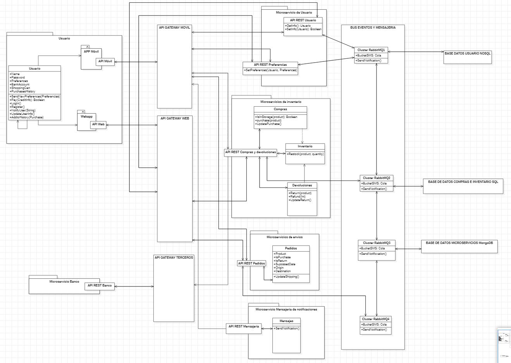

# ADR-0007 Componentes de presentación

## Identificador del Requisito

Requisito a tratar: 
* [RF2](../Requisitos/rf2.md) "Componentes de presentación"

## Contexto y problemas a resolver

En esta decisión se van a tener en cuenta qué información se presenta al usuario y como podremos obtenerla tras plantear el resto de la arquitectura. En cualquier caso, en ningún momento se entrará a debatir sobre detalles visuales o estéticos de la interfaz de las aplicaciones móvil o web. Por otro lado, cabe destacar que en el desarrollo de la arquitectura. algunas operaciones ya han sido implementadas para añadirle cierta coherencia a la decisión y a las relaciones de clases en su debido momento.

## Decisiones a tratar:

* **Opcion 1**:Por un lado, el usuario debe poder registrarse e iniciar sesión en el sistema. Además, debe poder cargar información con respecto a sus preferencias, compras actuales y compras concurrentes (tipico sistema de carrito de compra actual). Por otro lado, el sistema debe poder acceder a la plataforma de pago (ya realizado en otras decisiones) y recibir notificaciones que le envíe el sistema. Además debe ser capaz de actualizar su información personal (Nombre de cuenta, contraseña y cuenta bancaria) por si llega algún cambio. Evidentemente pueden implementarse una cantidad infinita de funcionalidades extra, pero estas son las que exige el cliente además de las que mantienen la coherencia, persistencia de datos, modularización y por tanto escalabilidad del sistema, y hacen de este sistema uno seguro. Finalmente estas implementaciones deben gestionarse desde la propia aplicación existente en los dispositivos del usuario, además de desarrollarse en JAVA para mantener ciertos paralelismos con otros módulos del sistema.
* **Opcion 2**: Las funcionalidades son las mismas que en la opción 1, pero implementadas en Python, ya que puede resultar más sencilla y directa su implementación.

## Decisiones tomadas

**Opcion elegida: Opcion 1**

Hemos elegido esta opción puesto que damos preferencia a una mayor coordinación en el sistema con otros modulos del mismo sobre la facilidad de su implementación. Además consideramos que, a priori, este sistema no tiene una dificultad de implementación tan elevada como para centrar nuestra atención principal en elegir el lenguaje de programación más sencillo posible a pesar de ser un factor hasta cierto punto determinante.

### Consecuencias positivas <!-- optional -->

* Mayor escalabilidad futura, ya que existen múltiples opciones para presentar nueva información al usuario.
* JAVA permite mantener coherencia con otros módulos del sistema.
* Muchas decisiones ya están diseñadas en el sistema en otras decisiones, luego será más sencillo de relacionar y/o implementar.
* Reducimos el problema a las preferencias y peticiones del cliente, por tanto, nos centramos en satisfacer sus necesidades y en mantener cierto nivel de persistencia.

### Consecuencias negativas <!-- optional -->

* Es posible que la implementación no sea tan directa como con otros lenguajes.
* Puede resultar una aplicación bastante básica de cara al usuario.

### Discusión ASC: Componentes de presentación

**Decisión ASC: Opcion 1**

## Decisión final tomada

**Decisión final: Opcion 1**

## Capturas CONTROL 

## UML de la decisión

