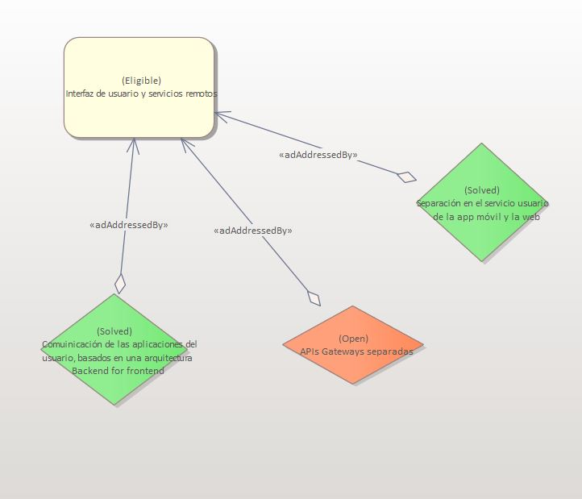
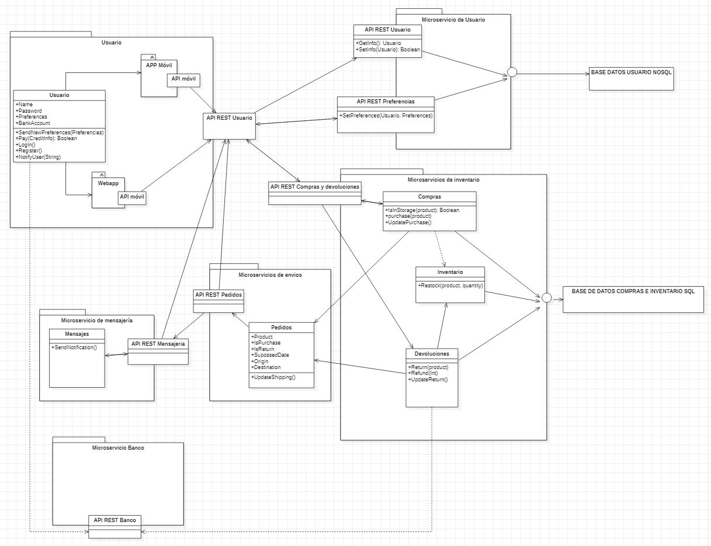

# ADR-0008 Módulo interfaz de usuario y módulo de servicios remotos

## Identificador del Requisito

Requisito a tratar: 
* [RF2.1](../Requisitos/rf2.1.md) "Control de interfaz de usuario"
* [RF2.2](../Requisitos/rf2.2.md) "Consumo de servicios remotos"

## Contexto y problemas a resolver

Se expone cómo se va a realizar el control de la interfaz de usuario y el control de los servicios remotos de la aplicación. La toma de decisión se tendrá en cuenta a lo ya aportado por el cliente así como las necesidad de sus servicio en posteriores requisitos como la conexión por GateWay a los servicios

## Decisiones a tratar:

* **Opcion 1**: Se realizará una separación entre la versión móvil, la WebApp y las posibles aplicaciones a terceros en el servicio del usuario, aplicando una arquitectura concreta de microservicios basada en Backend for frontends. Esto nos permitirá, en un futuro, diferenciar distintas API Gateways dependiendo de la necesidad y el entorno del servicio, dandonos gran aporte a utilizar algunas API REST específicas para un entorno y facilitando que no se propaguen errores en posibles conexiones errones a API REST que no deberían ejecutarse en un entorno en concreto (véase la mensajería para dispositivos móviles).

* **Opcion 2**: Se realizará un sistema de modelo vista controlador en la propia parte del cliente utilizando una única entrada por API Gateway permitiendo la diferenciación de los diferentes componentes visuales 
de la aplicación. Por lo tanto el propio cliente selecciona la api a la que tiene que conectarse para su función.

## Decisiones tomadas
* **OPCION 1 ELEGIDA**: Se toma esta decisión debido  a la necesidad del cliente de una clara separación de algunas APIs para distintos entornos en la aplicación facilitando el correcto mantenimiento y funcionamiento de la aplicación independientemente del entorno en el que se este realizando la petición. Esto facilita en gran medida la consistencia del programa y una estructuración mayor en el proyecto.

### Consecuencias positivas <!-- optional -->

* Al tomar esta decisión tomaremos la entrada que es necesaria para cada APIREST o servicio diferenciada de las demás facilitando su utilización
* Mayor modularidad de la aplicación y separación de la funcionalidad 
* Mejor mantenimiento y trackeo de errores.
* Versión más consistente y escalable para cada entorno independientemente de los demás que se encuentren en el sistema.

### Consecuencias negativas <!-- optional -->

* Mayor complejidad a la hora del desarrollo.
* Se tiene que realizar unas correctas practicas de desarrollo para que las ventajas que aporta esta arquitectura sea de la mayor posible.
* Es más dificil realziar un código más escalable si no se realiza de la forma correcta. Si se hace con buena praxis aporta mucha mas escalabilidad debido a las necesidades del producto.

### Discusión ASC: Módulo interfaz de usuario y módulo de servicios remotos

* Bueno, ya que al ofrecer una mayor separación de las funcionalidades será más sencillo acoplar nuevas o modificar las ya existentes.
* Bueno, ya que también existe diferenciación entre las entradas que facilita el uso de las APIREST
* Bueno, ya que mejora el mantenimiento de la plataforma y la detección de errores.
* Malo, ya que incrementa la complejidad a la hora de desarrollar.
* Malo, ya que hay que el desarrollo debe ser llevado de forma minuciosa para que favorecerse de las ventajas que ofrece esta arquitectura, lo que ofrecerá una mayor escalabilidad si se realiza de forma correcta, sino, no sirve de nada.

**Decisión ASC: Opcion 1**

## Decisión final tomada

**Opción elegida: Opción 1.**  
Ha sido determinante la modularidad que ofrece y la capacidad de expansión.

## Capturas CONTROL 

## UML de la decisión

**NOTA**: En el microservicio usuario, se puede observar como una única api rest usuario se comunica con el resto. Esto es una medida temporal, ya que en un futuro, como se comenta a lo largo de esta decisión, se cambiará por el sistema de APIs gateway separadas. Se ha mantenido de esta manera, puesto que aun las APIs gateway, aunque se deje claro cual es la idea que implementaremos, aun no ha sido sometida a la toma de decisiones, y de esta manera además, mantenemos el UML más clarificado.

