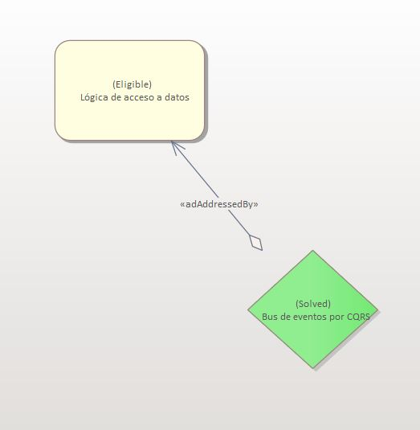
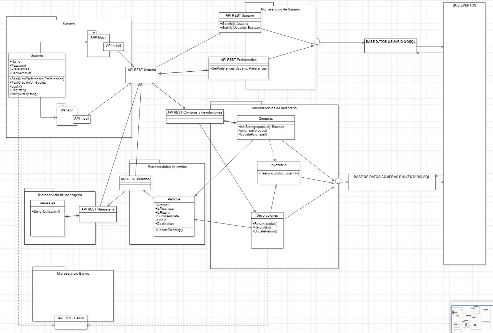

# ADR-0009 Lógica de acceso de datos

## Identificador del Requisito

Requisito a tratar: 
* [RF4](../Requisitos/rf4.md) "Lógica de acceso a bases de datos"

## Contexto y problemas a resolver
El cliente posee un sistema que gestiona las solicitudes mediante una lógica de negocio dos bases de datos (una SQL y otra NoSQL) que almacena datos de compras por internet y de preferencias de los clientes respectivamente. La toma de decisiones se enfocará en mantener un acceso cómodo y seguro para las bases de datos. 
Además se de deberá contar con una nueva base de datos en MongoDB para almacenar la localización de microservicios de la empresa y otros similares. Es necesario que exista una coherencia entre las bases de datos de los diferentes microservicios que se gestione a través de un bus de eventos lógicos s (e.g. Command and Query
Responsibility Segregation) que utilicen tecnología de mensajería como RabbitMQ o un “bus” dedicado como pueden ser Azure Service Bus, NServiceBus, MassTransit o Brighter. La selección de la tecnología se basará en aspectos de escalabilidad y prestaciones así como de interoperabilidad. 

## Decisiones a tratar:

* **Opcion 1**: Considerar la posibilidad de expresar la dependencia mediante interfaces de servicio (API) en lugar de una dependencia de base de datos directa. Eso permitiría a cada equipo de servicio cambiar su esquema de datos interno tanto como sea necesario y solo preocuparse por el diseño de la interfaz cuando se trata de dependencias. Esto es útil porque es más fácil agregar API adicionales y depreciar lentamente las API antiguas en lugar de cambiar el diseño de una base de datos junto con todos los microservicios dependientes (potencialmente al mismo tiempo). En otras palabras, aún puede implementar nuevas versiones de Microservice de forma independiente, siempre que las API antiguas aún sean compatibles.

* **Opcion 2**: Cada vez que realmente no puede evitar usar las mismas BD y está dividiendo los límites de su servicio de manera que varios equipos/servicios requieran las mismas entidades, introduce dos dependencias entre el equipo de Microservice y el equipo responsable del esquema de datos: a ) Formato de datos, b) Datos reales. Esto no es imposible de resolver, pero solo con cierta sobrecarga en la organización. Y si introduce demasiadas de estas dependencias, es probable que su organización se vea paralizada y ralentizada en el desarrollo.

* **Opcion 3**: Tendríamos dos bases de datos, lo que permitiría separarlo totalmente de otros microservicios. Cuando sea necesario, la coherencia entre las bases de datos de los diferentes microservicios se logra mediante eventos de integración de nivel de aplicación (a través de un bus de eventos lógicos), controlado por Command and Query Responsibility Segregation (CQRS). Por ese motivo, las restricciones de negocio deben adoptar la coherencia final entre los múltiples microservicios y bases de datos relacionadas.

## Decisiones tomadas

Opción 3 elegida: Parece que establecer un bus de datos controlado por CQRS que conecte unicamente las bases de datos, es la opción más sensata, sencilla de implementar y modularizada.

### Consecuencias positivas <!-- optional -->

* Mayor seguridad en caso de corrupción o posible pérdida de datos, al no depender únicamente de una sola Base de Datos.
* Mayor seguridad en cuanto a posible robo o filtración de seguridad.
* Reducción de tamaño de cada una de las Bases de Datos, lo que implica una mejora del uso de recursos.
* Mejora de las velocidades de acceso y recuperación de datos.

### Consecuencias negativas <!-- optional -->

* Mayor dificultad a la hora de realizar la implementación y relación de ambas Bases de Datos, al tener que contar con que no es un único elemento independiente.
* Aumento de la complejidad en tiempo a la hora de realizar un Backup completo.
* Posible desactualización de metadatos al poder ser distintos en las Bases de Datos, llevando a problemas con las relaciones y muestra de información.

### Discusión ASC: Arquitectura de Microservicios
+ Bueno, ya que se satisface lo que demanda el cliente.
+ Bueno, ya que al tener más de una base de datos conectadas mejora el rendimiento del sistema.
+ Bueno, aumento de la modularización del almacenamiento y acceso de datos
+ Malo, ya que puede darse el caso de que encontremos disonancias entre las BBDD
+ Malo, ya que aumenta la complejidad del manejo de las BBDD

**Decisión ASC: Opcion 3**

## Decisión final tomada
 
**Opción elegida: Opción 3.**

## Capturas CONTROL 

## UML de la decisión

