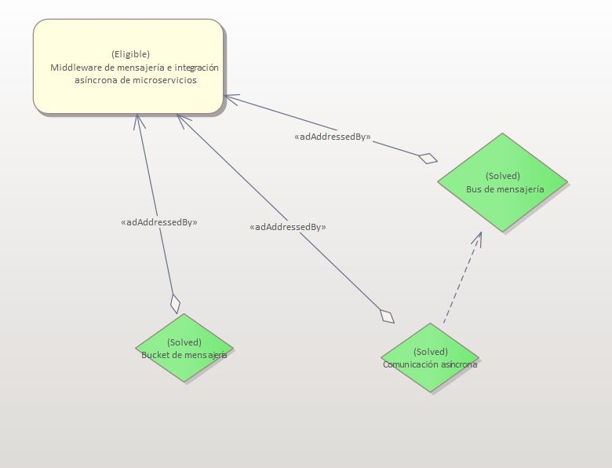

# ADR-0010 Middelware de mensajeria e integración asíncrona de microservicios

## Identificador del Requisito

Requisito a tratar: 
* [RF5](../Requisitos/rf5.md) "Sistema de mensajería por middelware independiente"
* [RF6](../Requisitos/rf6.md) "Integración asíncrona de los microservicios"

## Contexto y problemas a resolver

[Integración asíncrona de los microservicios](https://docs.microsoft.com/es-es/dotnet/architecture/microservices/architect-microservice-container-applications/communication-in-microservice-architecture)
[Middleware orientado a mensajes](https://bandabase.com/que-es-el-middleware-orientado-a-mensajes/)

## Decisiones a tratar:

* **Opcion 1**: Se toma un middleware orientado a mensajes mediante un portocolo AMQP (ya que es lo que solicita el cliente) de punto a punto, es decir, los mensajes quedan almacenados hasta que el receptor, en este caso los microservicios que han solicitado la información den el ok a la recepción, esto permite la integración asíncrona mediante el bus de mensajes entre los distintos microservicios.
* **Opcion 2**: Se toma un middleware orientado a mensajes mediante un portocolo AMQP (ya que es lo que solicita el cliente) de publicación/suscripcion en los ques e aporta la información a los receptores de forma periódica siempre y cuando este este aceptado para recibir la información proporcionada por el publicador.
* **Opcion 3**: Se toma la comunicación entre los microservicios mediante http polling, permitiendo realizar peticiones asincronas Http entre los distintos microservicios.

## Decisiones tomadas

* **OPCION 1 ELEGIDA**: Se toma esta opción debido a que el requisito por parte del cliente es que sea un sistema de mensajería entre los microservcios mediante AMQP, además al utilizar la mensajería punto a punto nos permite compartir de forma asíncrona entre los distintos microservicios gracias al módulo de mensajería en ambos sentidos de la comunicación, permitiendo aportar la información necesaria a distintos microservicios que necesiten x información así como requerirlas por estos para las distintas funcionalidades. Se mantiene la asincronidad así como la persistencia de los datos y la interoperabilidad de las operaciones ya que al llegar la información y las peticiones en el mismo orden de llegada de este al módulo, si uno de los microservicios se encuentra sin conexión o limitado por nuestra parte de alguna manera, nos garantiza que esas peticiones van a llegar de la forma y en tiempo correctos, ya que se quedan en la cola hasta ser tratados.

### Consecuencias positivas <!-- optional -->

* Interoperabilidad y asincronidad de las peticiones y comunicaciones.
* Peristencia de los datos y trata de ellos independientemente del formato de los datos y el destino de estos.
* Integridad del sistema en caso de gran carga o fallo de alguno microservicios.
* Facilita la restricción de peticiones posteriores en caso de ser necesario

### Consecuencias negativas <!-- optional -->

* Mayor complejidad de la aplicación.
* Dificil implementación y puesta en marcha.
* Si no se realiza de la forma correcta el mantenimiento puede dificultarse de forma exponencial. 

### Discusión ASC: Middelware de mensajeria e integración asíncrona de microservicios

+ Bueno, ya que ofrece una persistencia y una gestión de los datos muy conveniente.
+ Bueno, ya que posee un sistema robusto en caso de fallo de un microservicio.
+ Bueno, ya que una buena sincronización entre las comunicaciones y las peticiones es algo indispensable en un sistema como el que pide el cliente.
- Malo, ya que los primeros pasos del desarrollo y de las implementaciones requerirán más esfuerzo.
- Malo, ya que aumentará la complejidad de la aplicación además de dificultar sus mantenimiento si no se realiza de forma correcta.

**Decisión ASC: Opcion 1**

## Decisión final tomada

**Opción elegida: Opción 1.** 
Es necesaria la existencia de esa sincronía entre peticiones y comunicaciones aunque eso implique un aumento de la complejidad. 

## Capturas CONTROL 

## UML de la decisión

Los cambios en el UML de esta decisión se ven reflejados en la decisión [D0011](../decisiones/0011-Nueva-base-de-datos-bus-logico.md), ya que se trabajó conjuntamente en ambas decisiones al estar intimamente relacionadas. Se realiazó una versión previa de dicho uml al tomar esta decisión, pero como fue rapidamente modificada en la siguiente, no tiene sentido valorar un cambio que tan frágil y temporal.

