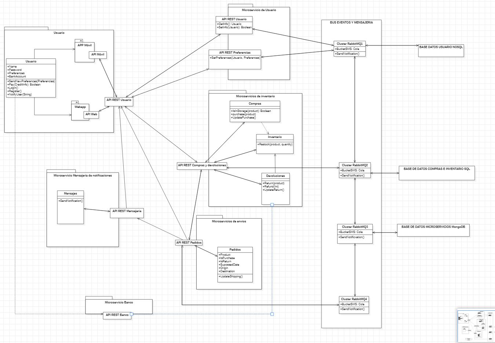

# ADR-0011 Creación nueva base de datos y bus lógico

## Identificador del Requisito

Requisito a tratar: 
* [RF5](../Requisitos/rf5.md) "Sistema de mensajería por middelware independiente"
* [RF6](../Requisitos/rf6.md) "Integración asíncrona de los microservicios"
* [RF7](../Requisitos/rf7.md) "Creación nueva base datos "
* [RF8](../Requisitos/rf8.md) "Integración bus eventos lógicos"

## Contexto y problemas a resolver
[ADR-0010](../decisiones/0010-Middleware-mensajeria-integracion-asincrona.md): Según se especifico en el ADR 10 era necesarío una conexión asíncrona de los microservicios mediante un MoM, que en ese caso se eligió por protocolo AMQP, se solicita crear un evento de bus lógico basado en mensajería para la persistencia de los datos y la conexión asíncrona, por lo tanto, el middleware de mensajería será el bus lógico de datos y se basará en las decisiones tomadas anteriormente.

A su vez se creará una nueva base de datos para la localización de los microservicios.

## Decisiones a tratar:

* **Opcion 1**: Se creará un bus lógico basado en RabbitMQ con 3 cluster para las distintas separaciones en las colas de mensajería. A su vez, se creará una base de datos conectada al bus en MongoDB para la localización de los microservicios.
* **Opcion 2**: Lo mismo que en la primera opción pero el bus lógico se creará en Azure Service Bus.
* **Opcion 3**: Lo mismo que en la primera opción pero el bus lógico se creará en MassTransit.

## Decisiones tomadas

* **OPCION 1 ELEGIDA**: Se tomará el bus lógico mediante RabbitMQ ya que como tomamos la decisión que el middleware de mensajería debería de ser en tecnología AMQP al utilizar el bus lógico con esta tecnología nos aporta este middleware de mensajería, así como la persistencia de los datos y las conexión asincrona entre los microservicios.

### Consecuencias positivas <!-- optional -->

* Interoperabilidad y asincronidad de las peticiones y comunicaciones.
* Peristencia de los datos y trata de ellos independientemente del formato de los datos y el destino de estos.
* Integridad del sistema en caso de gran carga o fallo de alguno microservicios.

### Consecuencias negativas <!-- optional -->

* Mayor complejidad de la aplicación.
* Dificil implementación y puesta en marcha.

### Discusión ASC: Arquitectura de Microservicios

+ Bueno, ya que ofrece una persistencia y una gestión de los datos muy conveniente.
+ Bueno, ya que posee un sistema robusto en caso de fallo de un microservicio.
+ Bueno, ya que una buena sincronización entre las comunicaciones y las peticiones es algo indispensable en un sistema como el que pide el cliente.
- Malo, complejidad adicional de los sistemas distribuido.
- Malo, mayor consumo de recursos, puesto que cada microservicio tiene su propio Sistema Operativo y dependencias.

**Decisión ASC: Opcion 1**

## Decisión final tomada

**Decisión final: OPCION 1**

## Capturas CONTROL 

## UML de la decisión

**NOTA**: Esta versión del UML incluye cambios no especificados en esta decisión, ya que también se aprecian cambios de la decisión [D0010](../decisiones/0010-Middleware-mensajeria-integracion-asincrona.md). Además, esta actualización incluye corrección de pequeños errores visuales y lógicos que estaban especificados en anteriores decisiones, pero de los que no nos habíamos percatado hasta ahora.

