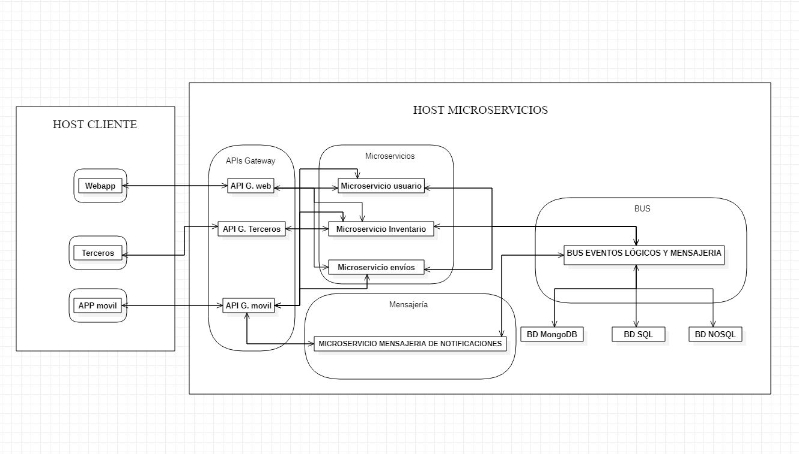

# ADR-0012 Determinar número de contenedores

## Identificador del Requisito

Requisito a tratar: 
* [RF9](../Requisitos/rf9.md) "Determinar número de contenedores"

## Contexto y problemas a resolver

Se debe determinar cuantos contenedores y host en docker van a albergar el sistema así como lo que contendrá cada uno de ellos.

## Decisiones a tratar:

* **Opcion 1**: Se crean dos host de contenedores diferenciados, uno para la parte cliente y otra para el apartado de los microservicios. En el host cliente se crearan 3 contenedores que contendrán respectivamente la webapp, la versión móvil y las aplicaciones de terceros. En el caso del host de microservicios estará formado por 4 contendores formados por: Los API GATEWAYS, los microservicios de usuario inventario y envios, otro para la mensajería móvil y por último uno para el bus de eventos lógicos.
* **Opcion 2**: Lo mismo que en el caso anterior solo que en vez de 4 contenedores en host de microservicios solamente habrá 3, unificando el 2 con el 3 de la opcion anterior.
* **Opcion 3**: Lo mismo que en la opción una solamente poniendo un contenedor con toda la información en cada uno de los host.
* **Opcion 4**: Lo mismo que en primer caso solo que en el host usuario unificar los 3 contenedores en uno solo.

## Decisiones tomadas

* **OPCION 1 ELEGIDA**: Esto es debido a que es más optimo tener diferencia los microservicios enfocados a la versión móvil en un único contenedor aparte, ya que facilita en gran medida el rendimiento así como la puesta en marcha e identificación de todos los módulos del sistema, a su vez al separar los API GATEWAYS y el bus de eventos lógico nos permite tener un mayor control de estos módulos facilitando el mantenimiento.

### Consecuencias positivas <!-- optional -->

* Mayor optimización y rendimineto.
* Mayor facilidad a la hora de realizar el mantenimiento de los componentes.
* Control total de los distintos sistemas y los microservicios.

### Consecuencias negativas <!-- optional -->

* Es importante realizarlo de la forma correcta para su correcto funcionamiento.
* Mayor complejidad de implementación.

### Discusión ASC: Arquitectura de Microservicios

**Decisión ASC: Opcion 1**

## Decisión final tomada

## Capturas CONTROL 

## UML de la decisión

**NOTA**: Como se puede comprobar a continuación, no se observa el mismo UML que anteriormente se había desarrollado. La cuestión es que, si se aprecia atentamente, se trata de una abstracción del mismo para representar los HOSTS y contenedores anteriormente descritos y explicados, para que de esta manera sea más legible y comprensible. Una vez entendido, es fácil establecer un paralelismo entre ambas versiones para poder conjuntar ambas descripciones del sistema.

