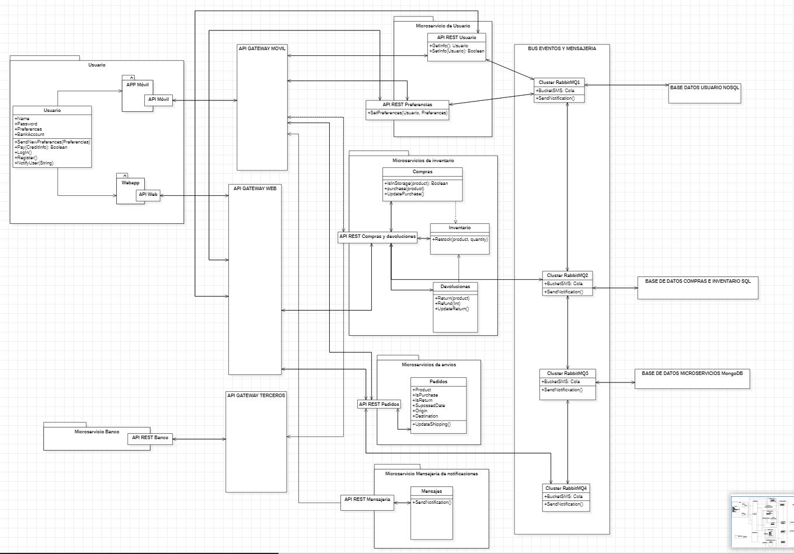

# ADR-0013 Vía de conexión y monitorización y comunicación de microservicios

## Identificador del Requisito

Requisito a tratar: 
* [RF10](../Requisitos/rf10.1.md) "Conexión y micorservicios"
* [RF10.1](../Requisitos/rf10.1.md) "Definir vía de conexión"
* [RF10.2](../Requisitos/rf10.2.md) "Definir comunicación  y monitorización de los microservicios"

## Contexto y problemas a resolver

Se trataran todas las comunicaciones por parte del cliente como http así como los gateway necesarios para la comunicación de los sistemas y monitorización de los microservicios

## Decisiones a tratar:

* **Opcion 1**: Se realizará una comunicación http a un único API Gateway para todos los microservicios con la separacion pertinente a aparte de la gestión cliente del servidor

* **Opcion 2**: Se realizará una comunicación http a 3 API Gateway diferencias acorde a cada gestión cliente de la aplicación permitiendo diferenciar los distintos sistemas y monitorización de los microservicios

## Decisiones tomadas
* **OPCION 2 ELEGIDA**: Se toma esta opción debido a la presencia de distintos microservicios específicos para algunos estados del sistema (Como por ejemplo el módulo de mensajería móvil)

### Consecuencias positivas <!-- optional -->

* Permite un mayor control de las API y su diferenciación
* Mayor rendimiento al tener separadas las distintas peticiones
* Mejor mantenimiento y trackeo del estado de los microservicios

### Consecuencias negativas <!-- optional -->

* Es más dificil de implementar y un poco más de trabajo
* Si no se realiza de la forma correcta puede dar más problemas de las ventajas que da

### Discusión ASC: Vía de conexión y monitorización y comunicación de microservicios

+ Bueno, ya que es esencial una correcta separación de las peticiones para una mejora de rendimiento y de control.
+ Bueno, ya que favorece el correcto mantenimiento y seguimiento de cara a futuras expansiones.
+ Malo, ya que una mala praxis puede desenvocar en un aumento de complejidad que aumenta la carga de trabajo ya de por sí elevada debido al tipo de implementación que se plantea.

**Decisión ASC: Opcion 2** 

## Decisión final tomada

**Opción elegida: Opción 2.** Si bien puede ser más costosa la primera implementación, es compensado con el gran control que ofrece sobre las APIS y un rendimiento superior al que podríamos conseguir si optáramos por la Opción 1.

## Capturas CONTROL 

## UML de la decisión

